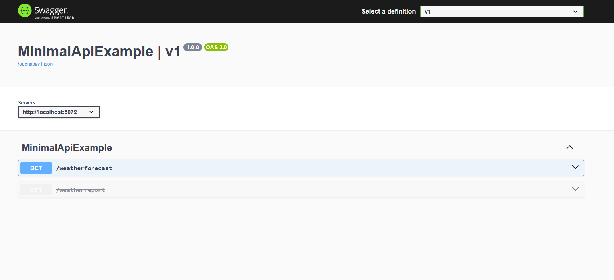
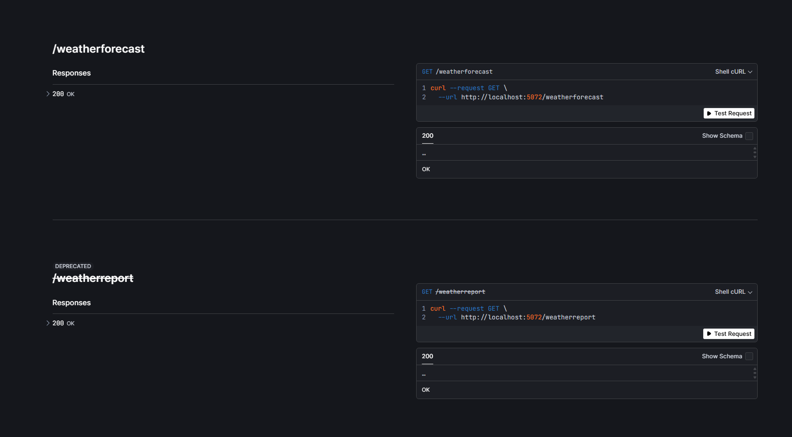

# Example Project

Run the project with the following command:

```bash
dotnet run
```

It will demonstrate the following endpoints being marked as `deprecated`.

## Swagger

Browse to the Swagger UI: `/swagger/index.html`



## Scalar

Brower to Scalar: `/scalar/v1`


